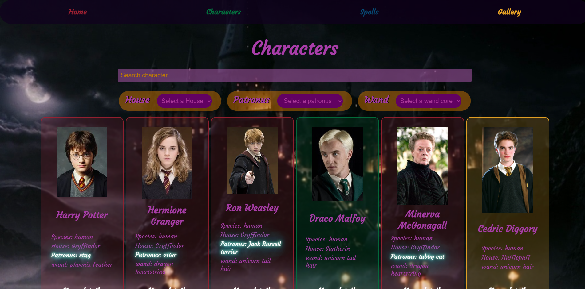
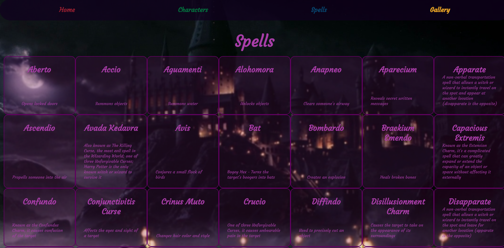

# Harry Potter API
This is a Harry Potter based fan page. You will find a variety of character cards that can be filtered by patronus, wand core and house. There is also a list of all the spells used in the books and a gallery of the best frames from the movies.
## Summary
### functionality
- Search engine for cards based on inputs and selects.
- Showcase Spells.
### Links
### Screenshots

### Improvements
- Change API to potterDB to acces more information.
- Introduce buttons to move between pages to improve user experience
- log in and register so anyone can save their favorite characters and spells.
- Show case in a map movie shooting locations.